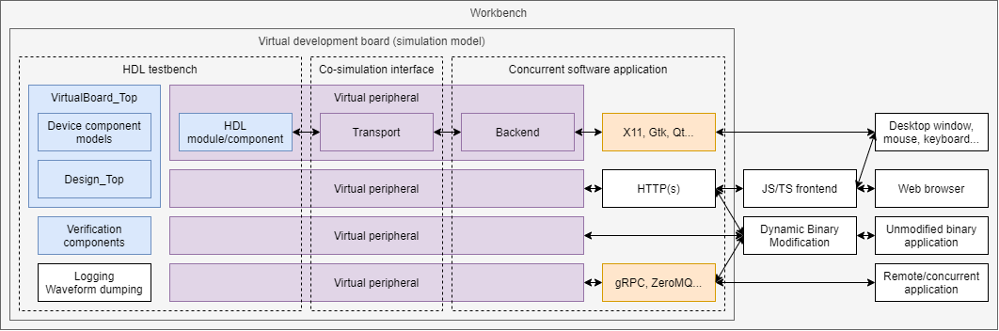

# Virtual development board for HDL design

This is a (proof of concept) library/framework of *virtual components* which can be reused for *building* testbenches using Hardware Description Languages (HDLs) and including software models/visualizations of non-trivial peripherals. Each virtual component is composed of three parts:

- Frontend (HDL module/component).
- Transport layer/mechanism.
- Backend (software library).

The purpose of this repository is to document the APIs used between the frontend and the transport, and between the tansport and the backend. Multiple projects exist which combine either [GHDL](https://hdl.github.io/awesome/items/ghdl/), [Icarus Verilog](https://hdl.github.io/awesome/items/iverilog/) or [Verilator](https://hdl.github.io/awesome/items/verilator/) with foreign languages (C/C++, Python, m, golang, JavaScript, etc.). Many of them implement the same peripherals (e.g. virtual VGA screen, pushbuttons, LEDs, etc.). However, there is no documented framework for sharing common resources. For instance, drawing the content of a framebuffer in a window is independent from how it is filled (either from VHDL, Verilog or some other HDL). Documenting intermediate APIs can hopefully help code reuse in the open source hardware development community.

  

## Development environment

- Frontend: See [OSVB: Simulators | Compilers](https://umarcor.github.io/osvb/intro/sim.html) and [OSVB: Frameworks and Methodologies](https://umarcor.github.io/osvb/intro/frameworks.html).
- Transport: VPI/DPI, VHPI/VFFI/VDPI, etc. See [OSVB: Co-simulation](https://umarcor.github.io/osvb/intro/cosim.html).
- Backend: ImageMagick, Xlib, Gtk, Qt, HTML/JS/CSS, [DBHI](https://dbhi.github.io/), etc.

All of these simulators and virtual peripherals can be executed on high-performance workstations or on low-cost SBCs. Some solutions are available on Android smartphones/tablets too. See [hdl/packages](https://github.com/hdl/packages) for further info about packaging/distribution alternatives for open source EDA tooling.

Tha main languages used for interfacing HDLs (VHDL, Verilog and/or System Verilog) with foreign languages are C/C++, since standard co-simulation interfaces are defined in those terms. However, several languages have built-in support for interacting with shared libraries and executable binaries using C semantics. Python, Rust or Julia, to name a few, provide built-in features for doing so. Moreover, [libffi](https://en.wikipedia.org/wiki/Libffi) provides a generalized solution for defining
target functions at runtime, instead of compile time.

With regard to distribution, there is work in progress for using `*.core` (YAML) files as a portable solution for defining filesets. See [OSVB: Core](https://umarcor.github.io/osvb/apis/core.html).

## Virtual peripherals

- [VGA screen](vga)

### Ideas

- Line follower robot.
- BLDC motor.
- GPS sensor.
- Virtual Nexys-4 like board ([gitlab.ensta-bretagne.fr/bollenth/ghdl-vpi-virtual-board](https://gitlab.ensta-bretagne.fr/bollenth/ghdl-vpi-virtual-board)):

  

- Visualization of hyperspectral/multispectral image processing cores ([VUnit/vunit#568](https://github.com/VUnit/vunit/pull/568)):

  

## References

- [ghdl/ghdl-cosim](https://github.com/ghdl/ghdl-cosim)
- [gitter.im/ghdl1/Lobby: 2019/07/12 8:12AM](https://gitter.im/ghdl1/Lobby?at=5d2824c0c3740260bb093989)
- [VUnit/cosim](https://github.com/VUnit/cosim)
- [renode.io](https://renode.io/)
  - [antmicro/renode-board-visualization](https://github.com/antmicro/renode-board-visualization)
    - Related to [hdl/constraints](https://github.com/hdl/constraints), and [j0ono0/pinout](https://github.com/j0ono0/pinout/) ([hdl/constraints#3](https://github.com/hdl/constraints/issues/3))
- [hackfin/ghdlex](https://github.com/hackfin/ghdlex)
  - https://section5.ch/doc/ghdlex/html/index.html
  - [hackfin/MaSoCist](https://github.com/hackfin/MaSoCist)
- [sylefeb/Silice: Silice Verilator graphical simulation framework](https://github.com/sylefeb/Silice/tree/draft/frameworks/verilator)
- [yaqwsx/Pinion](https://github.com/yaqwsx/Pinion): *generate interactive and nice-looking diagrams for your PCBs!* ([yaqwsx.github.io/Pinion](https://yaqwsx.github.io/Pinion/))
- [olofk/verilatio](https://github.com/olofk/verilatio)
- [MathInspector/MathInspector](https://github.com/MathInspector/MathInspector)
  - [What's New in Math Inspector Beta](https://www.youtube.com/watch?v=M7U8dgPo0Bw)
  - [The Math Inspector Source Code](https://www.youtube.com/watch?v=hUHiihuOt2A)
- [ZipCPU/vgasim](https://github.com/ZipCPU/vgasim)
  - [zipcpu.com/blog: Building a video controller: it's just a pair of counters](https://zipcpu.com/blog/2018/11/29/llvga.html)
  - [juanmard/screen-pong@gtk-verilator/game-pong/verilog](https://github.com/juanmard/screen-pong/tree/gtk-verilator/game-pong/verilog)
- [8bitworkshop.com](https://8bitworkshop.com/)
  - [sehugg/8bitworkshop](https://github.com/sehugg/8bitworkshop)
  - https://8bitworkshop.com/redir.html?platform=verilog
- [adumont/hrm-cpu@master/gui](https://github.com/adumont/hrm-cpu/tree/master/gui)
- [isotel/mixedsim](https://github.com/Isotel/mixedsim)
  - [isotel.eu/mixedsim](https://www.isotel.eu/mixedsim/#)
- [labsland.com](https://labsland.com)
- [redwoodeda.com](https://www.redwoodeda.com/)
  - [tl-x.org](http://tl-x.org/)
    - [redwoodeda.com/tl-verilog](https://www.redwoodeda.com/tl-verilog)
    - [stevehoover/warp-v](https://github.com/stevehoover/warp-v)
  - [makerchip.com](https://www.makerchip.com/)
  - [stevehoover/1st-CLaaS](https://github.com/stevehoover/1st-CLaaS)
    - [linkedin.com: Paving the Way for FPGA Accelerated Web Applications](https://www.linkedin.com/pulse/paving-way-fpga-accelerated-web-applications-%25C3%25A1kos-hadnagy)
    - [opensource.googleblog.com: Unleashing Open Source Silicon](https://opensource.googleblog.com/2019/09/unleashing-open-source-silicon.html)
    - [abopen.com: 1st CLaaS and Google Summer of Code Work to “Open The Floodgates” of Free and Open Source Silicon](https://abopen.com/news/1st-claas-and-google-summer-of-code-work-to-open-the-floodgates-of-free-and-open-source-silicon/)
  - [fractalvalley.net](http://fractalvalley.net/)
- [tinkercad.com/circuits](https://www.tinkercad.com/circuits)
- [gitpod.io](https://www.gitpod.io/)
- [TerosTechnology/terosHDL](https://github.com/TerosTechnology/terosHDL)
- GHDL, GRT and clock-gating: use `unsigned(63 downto 0)` instead of two `integer`. See https://github.com/VUnit/vunit/commit/89957a9b227ace890bfbfab0d50ff59940560b5c.
- Python web frameworks:
  - [Tornado](https://www.tornadoweb.org/en/stable/)
  - [Flask](https://palletsprojects.com/p/flask/)
- [hipolitoguzman/virtualboard](https://github.com/hipolitoguzman/virtualboard)
