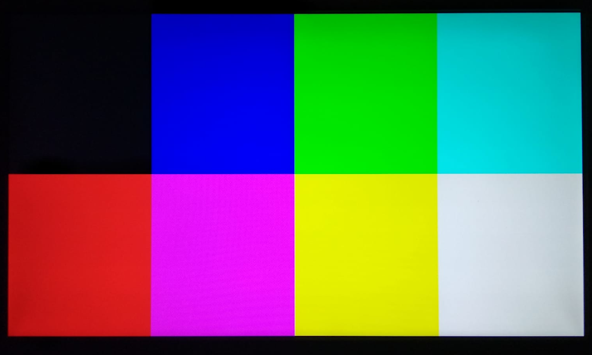
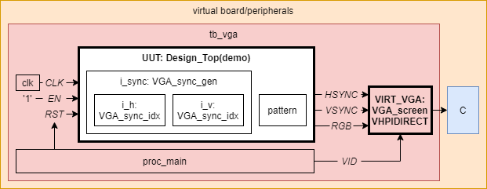

# VGA test pattern

This component aims to provide [Video Graphics Array](https://en.wikipedia.org/wiki/Video_Graphics_Array) (VGA) output examples for "*all the FPGA dev boards in the world*" ([sic](https://github.com/fusesoc/blinky)). It allows quickly testing your FPGA board and a monitor through tens of supported VGA modes (see [VGA_config_pkg.vhd](src/VGA_config_pkg.vhd)).

At the same time, the goal is to provide a reference structure for HDL projects with the following requirements:

- Design sources are written in VHDL and/or Verilog.
- Multiple target boards (hence, devices) are supported.
- Open source tooling and vendor tooling are used, for simulation, synthesis, implementation and programming.
- Open source resources are reused.

The sources of this component are organised as follows:

- `board`: a subdir for each supported board, where HDL sources specific to the board are located.
- `device`: a subdir for each supported device, where HDL sources specific to the device are located. These sources are expected to be used in HDL sources located in `board/*/`.
- `src`: HDL sources of the component, which are common for simulation and/or synthesis, and for any target.
- `test`: resources for simulation (testing and verification), including testbenches, unit tests and co-simulation cores (such as a virtual screen).

Users willing to write their own applications/designs with VGA output are encouraged to clone this component and to adapt [demo.vhd](src/demo.vhd) for plugging their designs. The synchronism generation module (`VGA_sync_gen` or `VGA_sync_gen_cfg`) can be preserved, so that only the application logic needs to be described.

## Standing on the shoulders of...

The structure of this repository was heavily inspired by [PLC2/Solution-StopWatch](https://github.com/PLC2/Solution-StopWatch); the solution used by [Patrick Lehmann](https://github.com/Paebbels) in [PLC2](https://www.plc2.com)'s 5-day class [Professional VHDL](https://www.plc2.com/en/training/detail/professional-vhdl).

The idea about supporting "*all the FPGA dev boards in the world*" was borrowed from [fusesoc/blinky](https://github.com/fusesoc/blinky); one of the examples in the [base library](https://github.com/fusesoc/fusesoc-cores) of [Olof Kindgren](https://github.com/olofk/)'s [FuseSoC](https://github.com/olofk/fusesoc).

The makefile for mixed language synthesis using open source tooling ([GHDL](https://github.com/ghdl), [Yosys](https://github.com/YosysHQ/yosys), [nextpnr](https://github.com/YosysHQ/nextpnr), [icestorm](https://github.com/cliffordwolf/icestorm), etc.) was borrowed from [im-tomu/fomu-workshop](https://github.com/im-tomu/fomu-workshop); the workshop for the [Fomu](https://github.com/im-tomu/fomu-hardware) board by [Tim Ansell](https://github.com/mithro) and [Sean Cross](https://github.com/xobs).

Unlike all previous references, where ad-hoc constraint files (`*.xdc`, `*.pcf`, etc.) are used, here implementation constraint are imported from an open source repository. [hdl/constraints](https://github.com/hdl/constraints/) (based on [VLSI-EDA/PoC: ucf/](https://github.com/VLSI-EDA/PoC/tree/master/ucf)) is a submodule of this repository, and constraints are imported from there.

Co-simulation and the virtual screen are implemented using GHDL's VHPIDIRECT examples from [ghdl/ghdl-cosim](https://github.com/ghdl/ghdl-cosim). See [[LCS-202x] VHDL DPI/FFI based on GHDL’s implementation of VHPIDIRECT](https://umarcor.github.io/ghdl-cosim/vhdl202x/).

## Usage

> NOTE: for now, the only supported toolchain is: ghdl-yosy-plugin + Yosys + nextpnr. [open-tool-forge/fpga-toolchain](https://github.com/open-tool-forge/fpga-toolchain) provides ready-to-use packages for GNU/Linux, Windows or macOS, which include all of them. See [github.com/open-tool-forge/fpga-toolchain#installation](https://github.com/open-tool-forge/fpga-toolchain#installation).

First, run synthesis and implementation:

```sh
make VGA_BOARD=<BOARD_SUBDIR>
```

For instance:

```sh
make VGA_BOARD=icestick
```

Then, load the bitstream to the board. The following pattern should be shown in the monitor:

<p align="center">
  
</p>

### Select a different VGA mode

Package [VGA_config_pkg.vhd](src/VGA_config_pkg.vhd) contains a table (described as an array of records) with parameter values (pulse, porch, pixel clock rate, polarity, etc.) for +60 VGA/VESA/SXGA/XGA modes. The table is used in the VGA signal generator, allowing changing the mode through a parameter of type `integer`.

At the same time, the top level entity for each board includes a generic integer with a default value. GHDL allows overriding generics through the CLI. Therefore `make GHDL_FLAGS=-gSCREEN=<mode index>` allows selecting a different mode without modifying HDL sources.

## Testing

Sources in [test/hdl/](test/hdl) provide a *Virtual VGA screen* based on the [VGA (RGB image buffer)](https://ghdl.github.io/ghdl-cosim/vhpidirect/examples/arrays.html#vga-rgb-image-buffer) from [ghdl.github.io/ghdl-cosim](https://ghdl.github.io/ghdl-cosim). A VGA monitor (VHDL) reads the output of the UUT and draws frames in a buffer, packing the colours of each pixel in a 32 bit `integer`. After each frame is complete, foreign subprogram `save_screenshot` is executed. Just before finishing the simulation, foreign subprogram `sim_cleanup` is executed.

<p align="center">
  
</p>

### Imagemagick (animated GIF)

[test/imagemagick/](test/imagemagick) provides a backend for the virtual screen based on [Imagemagick](https://www.imagemagick.org/). `save_screenshot` saves each frame to a binary file in RGB24 format. Then, `convert` from Imagemagick is used for generating a PNG screenshot. In `sim_cleanup`, `convert` is used for merging all the PNGs into an animated GIF. Execute the run script for running the simulation:

```sh
./test/imagemagick/run.sh
```

Images are saved to `test/imagemagick/out/`.

### Tkinter (desktop window)

[test/tkinter/](test/tkinter) provides a backend for the virtual screen based on [tkinter](https://docs.python.org/3/library/tkinter.html), the built-in Python interface to Tcl/Tk. The Tk GUI toolkit is available on most Unix platforms, as well as on Windows systems. [NumPy](https://numpy.org/)'s [ctypeslib](https://numpy.org/doc/stable/reference/routines.ctypeslib.html) and [Pillow](https://python-pillow.org/)'s [ImageTk](https://pillow.readthedocs.io/en/stable/reference/ImageTk.html) are used for transforming the VHDL buffer to an image and for displaying the frames in a desktop window. After installing the dependencies, execute the run script for running the simulation:

```sh
./test/tkinter/run.sh
```

A windows is shown on the desktop and it is updated after each frame is captured by the VHDL VGA monitor.

> NOTE: On MSYS2's MINGW64, `numpy` needs to be installed through `pacman`. Furthermore, installing `Pillow` through `pip` requires the packages listed in [pillow.rtfd.io: Building on Windows using MSYS2/MinGW](https://pillow.readthedocs.io/en/stable/installation.html#building-on-windows-using-msys2-mingw).

## Development

### How to add a board

- Check in [Issues](https://github.com/dbhi/vboard/issues?q=is%3Aopen+) whether some other user is already working on it.
- Create a subdir in `board/<SUBDIR_NAME>` and a file named `board/<SUBDIR_NAME>/<BOARD_NAME>_Top.<EXTENSION>`. Create an entity named `<BOARD_NAME>_Top` and an architecture.
- Find the board in [../constraints](../constraints). If not found, open an issue or submit a Pull Request to [hdl/constraints](https://github.com/hdl/constraints).
- Add ports to `<BOARD_NAME>_Top`, according to the constraint files corresponding to the board.
- Instantiate `Design_Top(demo)` in the `<BOARD_NAME>_Top` unit.
- Connect the `Design_Top` to the top level ports. If required, negate them or do other conversions specific to the board. Typically, the external clock needs to be adapted with some PLL|DCM|MMCM for matching the expected pixel clock for the selected mode.
  - [device/](device/) contains components and packages which map multiple PLL|DCM|MMCM parameters to the table of all supported modes. Therefore, an optional `board/<SUBDIR_NAME>/<BOARD_NAME>_config_pkg.<EXTENSION>` package can be used. See, for example, [board/icestick/Icestick_PLL_config_pkg.vhd](board/icestick/Icestick_PLL_config_pkg.vhd).

> Currently, the only supported build system is a Makefile. However, we are willing to support the following managers/runners:
>
> - [VUnit](https://github.com/VUnit/vunit)
> - [PyFPGA](https://gitlab.com/rodrigomelo9/pyfpga)
> - [cocotb](https://github.com/cocotb/cocotb)
> - [FuseSoC](https://github.com/olofk/fusesoc) and [edalize](https://github.com/olofk/edalize).

- At the top of the [Makefile](Makefile), add the variable values corresponding to the added board.
- [Open a Pull Request](https://github.com/dbhi/vboard/compare)!

### How to implement a different virtual VGA backend

Any application/library which satisfies the following C prototypes can be used as a backend:

```C
void save_screenshot(int32_t *ptr, uint32_t width, uint32_t height, int id)

void sim_cleanup(void)
```

See [test/imagemagick/caux.c](test/imagemagick/caux.c) for an example of how to convert the 32 bit integer to RGB24.

Nevertheless, implementation is not limited to C/C++. Other languages (such as Python or Rust) provide nice integration with C. See example [pycb](https://ghdl.github.io/ghdl-cosim/vhpidirect/examples/shared.html#pycb) from [ghdl.github.io/ghdl-cosim](https://ghdl.github.io/ghdl-cosim).
